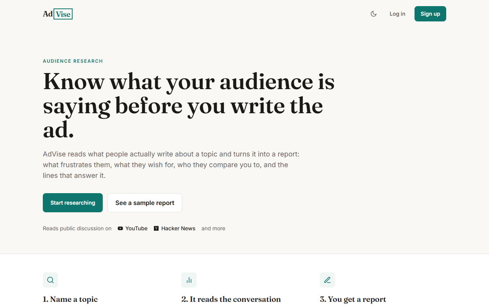
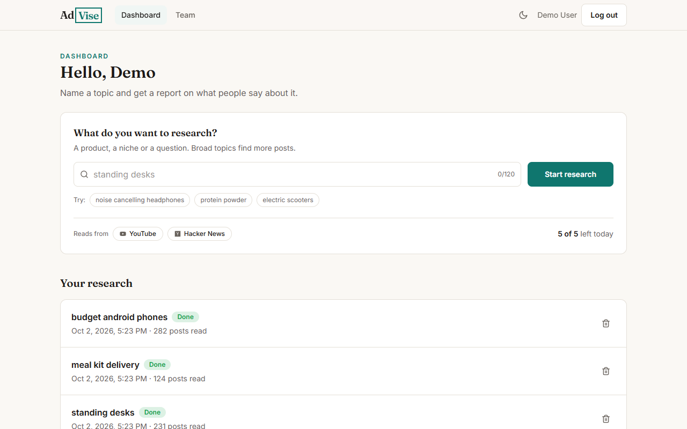
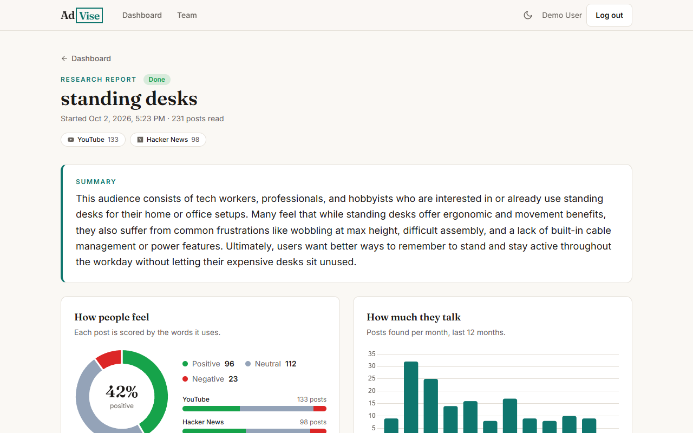
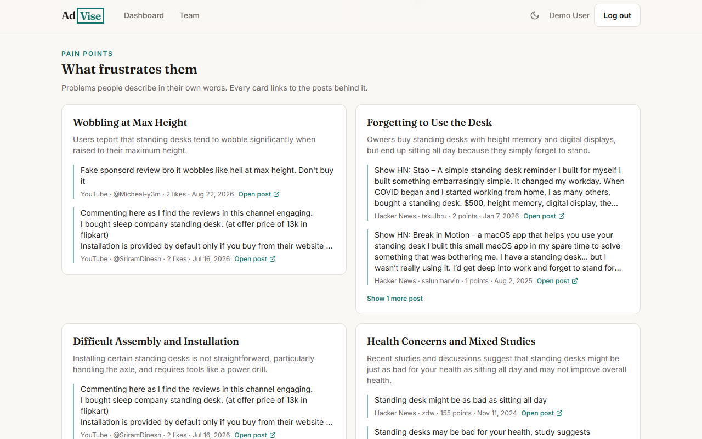
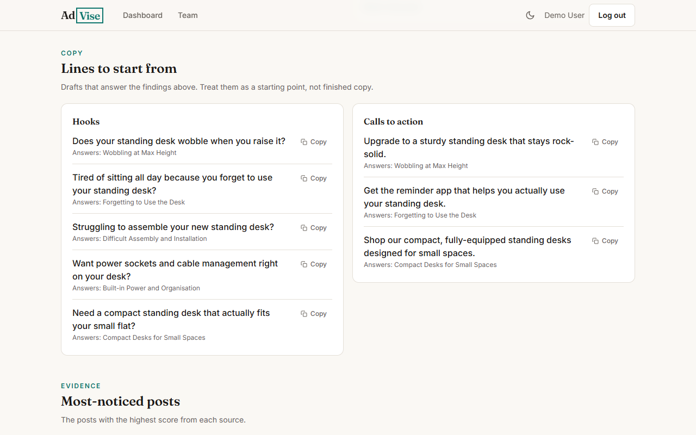
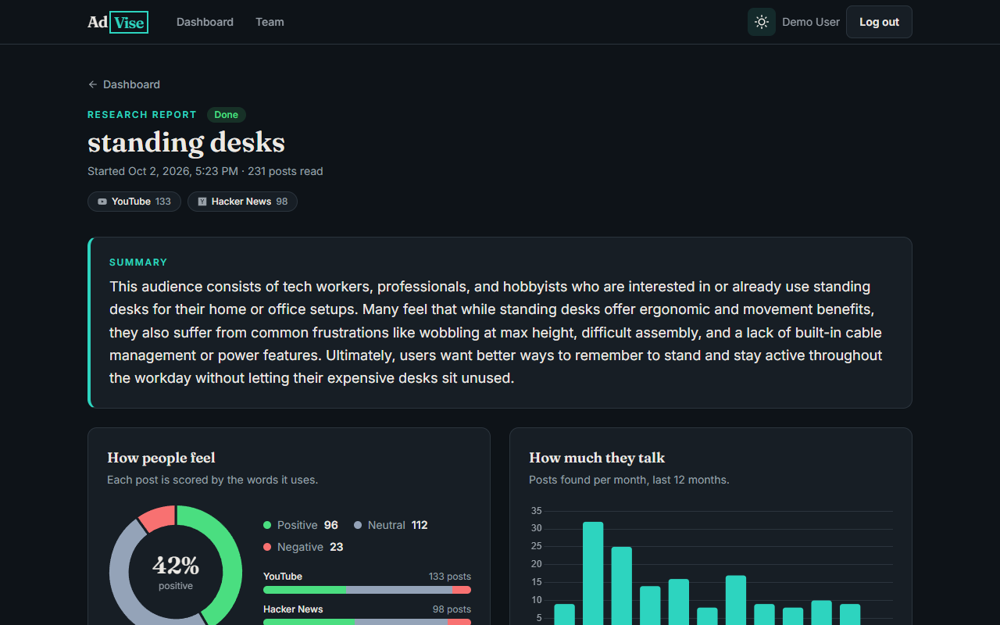
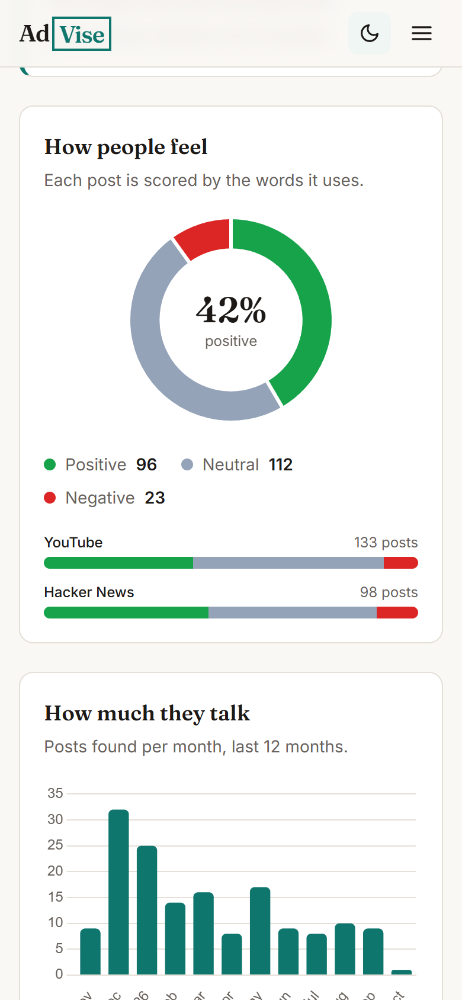
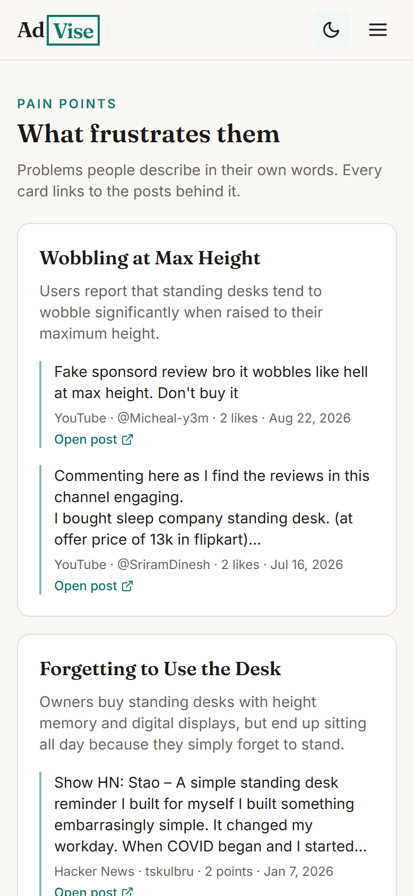

# AdVise

AdVise turns a topic into an audience research report. Type a product, a niche
or a question; AdVise reads what people write about it in public and reports
the pain points, wishes, competitors, sentiment and volume it finds, with ad
hooks and calls to action that answer them. Every finding links to the posts
it came from.

The project started at the Level SuperMind hackathon in January 2025.

## Live demo

**<https://ad-vise.vercel.app>**

Log in with the demo account to read finished reports without signing up. The
login page has a button for it.

| Email | Password |
|---|---|
| `demo@advise.demo` | `Demo@123` |

- The demo reports are real researches, made from public posts at the time
  they were run.
- The API runs on a free plan that sleeps when idle, so the first request can
  take up to a minute.
- You can also sign up with your own email address; a verification link is
  sent to it. Each account can run five researches a day.

## Screenshots

**Landing page**



**Dashboard:** start a research and see earlier ones.



**Report:** summary, sentiment and volume over the last 12 months.



**Pain points,** each with the posts that support it.



**Hooks and calls to action,** ready to copy.



**Dark theme and phone layout**



<p>
  
  &nbsp;&nbsp;
  
</p>

## Features

- **Research from live data:** posts and comments are collected from YouTube
  and Hacker News, and from Reddit when credentials are configured.
- **Sentiment and volume:** every post is scored, and posts are counted per
  month for the last 12 months.
- **Written insights:** pain points, wishes and competitors, each backed by
  quotes that link to the original posts.
- **Ad copy:** hooks and calls to action tied to the findings.
- **Progress while it runs:** a research takes 10 to 40 seconds and reports
  its stage as it goes.
- **History:** every report is kept on the dashboard until it is deleted.
- **Accounts:** sign-up with email verification, login, logout and password
  reset.
- **Light and dark themes,** usable on a phone.

## How a research works

1. The topic is stored and the request is answered at once.
2. A background job searches every enabled source at the same time. A source
   that fails or takes longer than 10 seconds is skipped and named in the
   report.
3. Sentiment and monthly volume are computed in code.
4. A sample of at most 120 posts, balanced across sources, goes to the
   language model, which writes the insights as structured data. Anything it
   cites that was not in the sample is removed, and a finding with no post
   behind it is dropped.
5. The web app asks for progress every two seconds and shows the report when
   it is done.

A user can run five researches a day, one at a time. Failed researches do not
count, up to fifteen attempts a day. See [docs/design.md](docs/design.md) for the details.

## Tech stack

| Part | Stack |
|---|---|
| Frontend | React 18, Vite, Tailwind CSS, React Router, Axios, Chart.js |
| Backend | Node.js, Express, MongoDB with Mongoose, JSON Web Tokens, Nodemailer |
| Data | YouTube Data API, Hacker News Search API, Reddit API (optional) |
| Language model | Gemini, through the Google Gen AI SDK |
| Tests | Jest, Supertest, in-memory MongoDB |

## Getting started

### Prerequisites

- Node.js 20 or newer
- A MongoDB connection string (local MongoDB or MongoDB Atlas)
- A Gemini API key from [Google AI Studio](https://aistudio.google.com/apikey)
- A YouTube Data API v3 key from the [Google Cloud console](https://console.cloud.google.com/apis/library/youtube.googleapis.com)
- SMTP credentials or a Brevo API key for the verification and reset emails

### Setup

```bash
git clone https://github.com/samirsuroshe18/level_supermind_hackathon_project.git
cd level_supermind_hackathon_project

cd server
npm install
cp .env.example .env     # then fill in the values, see below

cd ../client
npm install
```

### Environment variables

`server/.env`:

| Key | Purpose |
|---|---|
| `MONGODB_URI` | Database connection string |
| `PORT`, `SERVER_HOST` | Where the API listens (`3000`, `localhost`) |
| `CORS_ORIGIN` | Web app origin (`http://localhost:5175`) |
| `FRONTEND_URL` | Base URL used in email links (`http://localhost:5175`) |
| `ACCESS_TOKEN_SECRET`, `ACCESS_TOKEN_EXPIRY` | Access token signing, for example a long random string and `1d` |
| `REFRESH_TOKEN_SECRET`, `REFRESH_TOKEN_EXPIRY` | Refresh token signing, for example a long random string and `10d` |
| `MAIL_HOST`, `EMAIL_PORT`, `MAIL_USER`, `MAIL_PASS` | SMTP settings |
| `BREVO_API_KEY`, `MAIL_FROM` | Optional. Send email through the Brevo HTTPS API instead of SMTP, from this verified sender |
| `GEMINI_API_KEY` | Key for the language model |
| `GEMINI_MODEL` | Optional. Model name, `gemini-3.5-flash-lite` by default |
| `YOUTUBE_API_KEY` | Enables the YouTube source |
| `REDDIT_CLIENT_ID`, `REDDIT_CLIENT_SECRET` | Optional. Enables the Reddit source |
| `DAILY_RESEARCH_LIMIT` | Optional. Researches per user per day, `5` by default |

A source without its key is switched off, and the app only mentions the
sources that are on. Hacker News needs no key.

### Run

Start the API and the web app in two terminals:

```bash
cd server
npm run dev
```

```bash
cd client
npm run dev
```

Open <http://localhost:5175>. The web app proxies `/api` to the API on port
3000.

### Demo data

```bash
cd server
npm run seed
```

This creates the account `demo@advise.demo` with the password `Demo@123` and
runs three real researches for it, so it calls the sources and the language
model. The login page has a button for this account. Its reports cannot be
deleted, so every visitor finds them. Running the script again
replaces the account and its reports and touches nothing else.

### Tests

```bash
cd server
npm test
```

The tests start their own in-memory database. They never call an outside
service and never send email.

### Deployment

The API and the web app can be hosted separately, for example the API on
Render and the web app on Vercel.

**API**

- Root directory `server`, build command `npm install`, start command `npm start`.
- Set the variables from `server/.env.example`, with `NODE_ENV=production` and
  `SERVER_HOST=0.0.0.0`. Leave `PORT` to the host if it provides one.
- `CORS_ORIGIN` and `FRONTEND_URL` are the public address of the web app.
- If the host blocks outgoing mail ports, set `BREVO_API_KEY` and `MAIL_FROM`
  so email is sent over HTTPS.
- A research runs inside the API process. If the process restarts, a research
  in progress is marked as failed and can be started again.

**Web app**

- Root directory `client`, build command `npm run build`, output directory `dist`.
- `client/vercel.json` forwards `/api` to the API, so the login cookie stays
  on the web app's own address. Set the destination there to your API's
  address.

## Project structure

```
server/
  src/
    app.js              Express app, routes and error handling
    index.js            Starts the server
    controllers/        Request handlers
    middlewares/        Authentication
    models/             User, Research
    routes/             Route definitions
    sources/            YouTube, Hacker News and Reddit collectors
    analysis/           Sentiment, volume, sampling and written insights
    jobs/               The background research job
    utils/              Mail sender, daily limit, helpers
    scripts/seed.js     Demo account
  tests/                API, source, analysis and job tests
client/
  src/
    api/                Axios client and research requests
    context/            Login state and theme
    hooks/              Research polling, chart colours
    components/         Shared pieces, charts and report sections
    pages/              Landing, account pages, dashboard, report, team
    data/               Sample report and team
docs/
  design.md             Design of the application
```

## API overview

All routes are under `/api/v1`. Research routes need a logged-in user and only
return that user's researches.

| Area | Routes |
|---|---|
| Accounts | `POST /users/register`, `POST /users/login`, `GET /users/logout`, `GET /users/me`, `POST /users/forgot-password` |
| Email links | `GET /verify/verify-email`, `GET /verify/reset-password`, `POST /verify/verify-password` |
| Research | `GET /research/meta`, `POST /research`, `GET /research`, `GET /research/:id`, `DELETE /research/:id` |

## Team

Built by Samir Suroshe ([@samirsuroshe18](https://github.com/samirsuroshe18)),
Mohit Dhangar ([@mohit45v](https://github.com/mohit45v)),
Tanishq Kulkarni ([@TanishqMSD](https://github.com/TanishqMSD)) and
Pranay Sanap ([@pranaysanap](https://github.com/pranaysanap)).
